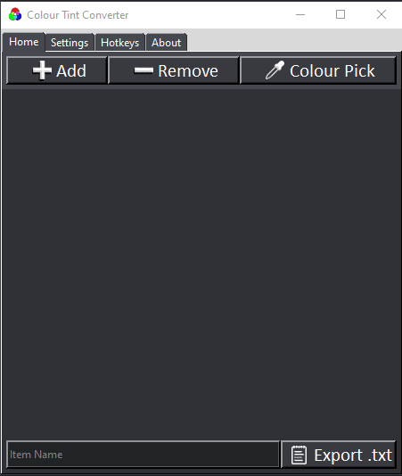

# Colour Tint Converter

## About

A handy tool for quick grabbing and converting colour tints to hex values. Supports sRGB
sRGB' and sRGB8. Developed by Kieren Townley-Moss, Jake Broughton and Alex Todd.

## Features

- Quick addition and removal of entries via hotkeys
- .txt file output for easy reference (with save location selection via settings)
- Interactve colour picker 
- Stay-on-top mode for fast access when using other software
- Light and dark mode
- Hotkeys to save you time

## Usage
- Easily make colour pallets and export sRGB and hex value to a .txt
- Convert sRGB [0,1], sRGB' [0,1], sRGB [0,255] to hex values
- Colour pick directly from your program

## Installation
### Option 1
1 - Download Colour_Tint_Converter_Installer.exe
2 - Run installer to select install location and install
3 - Run ColourTintConverter.exe within install location

### Option 2
1 - Download all files from within GitHub and run ColourTintConverter.exe

## Changelog
